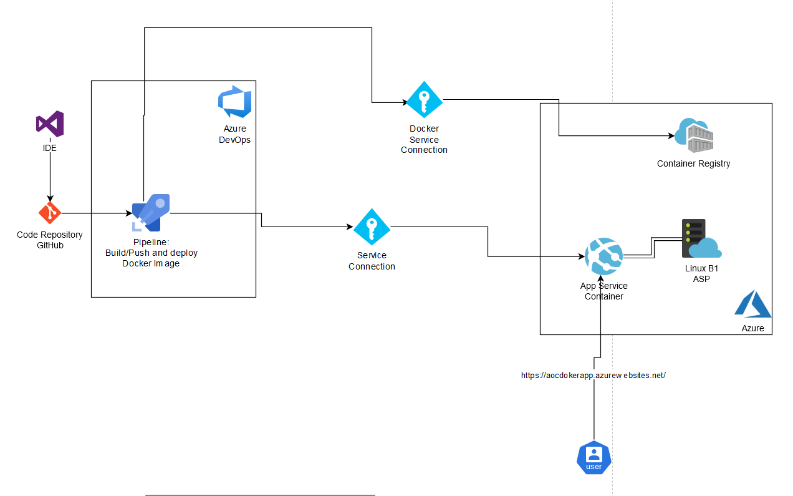

# Read me

## Architecture


#### The entire deploy process is automated, the developer commits to main and it performs the respective deploy to the App Service. If you require specific information, you can review the following explanation of each file and how it allows this automation to be carried out.

## Files

### GitHub: 
https://github.com/Yohnjo/DevOpsAOCflask/tree/main

### Dockerfile: 

#### Base Image

```dockerfile
FROM python:3.8.2-alpine3.11
```
- **FROM**: Specifies the base image to use for the Docker image.
- `python:3.8.2-alpine3.11`: Uses the Python 3.8.2 runtime on an Alpine Linux 3.11 distribution. Alpine is a minimal Docker image based on Alpine Linux, which helps keep the image size small.

#### Environment Variables

```dockerfile
ENV FLASK_APP=main.py
ENV FLASK_ENV=development
```
- **ENV**: Sets environment variables.
- `FLASK_APP=main.py`: Defines the entry point for the Flask application as `main.py`.
- `FLASK_ENV=development`: Sets the environment to development mode, which enables features like debugging.

#### Copy Files

```dockerfile
COPY . /app
```
- **COPY**: Copies files and directories from the host machine to the Docker image.
- `.`: Refers to the current directory on the host machine.
- `/app`: The destination directory in the Docker image where the files will be copied.

#### Working Directory

```dockerfile
WORKDIR /app
```
- **WORKDIR**: Sets the working directory for subsequent instructions.
- `/app`: The directory in the Docker image where commands will be executed.

#### Install Dependencies

```dockerfile
RUN pip install -r requirements.txt
```
- **RUN**: Executes a command in the Docker image.
- `pip install -r requirements.txt`: Installs the Python dependencies listed in the `requirements.txt` file.

#### Entry Point

```dockerfile
ENTRYPOINT FLASK_APP=/app/server.py flask run --host=0.0.0.0 --port=80
```
- **ENTRYPOINT**: Specifies the command that will run when a container is started from the image.
- `FLASK_APP=/app/server.py`: Sets the `FLASK_APP` environment variable to `/app/server.py`.
- `flask run --host=0.0.0.0 --port=80`: Runs the Flask application, making it accessible on all network interfaces (`0.0.0.0`) and on port `80`.

---

### Flask Application - server.py

This document provides an explanation of the `server.py` file, a simple Flask application that serves a message encoded in UTF-8.

#### Code Explanation

#### Importing Flask

```python
from flask import Flask
```

This line imports the Flask class from the `flask` module, which is essential to create a Flask application.

#### Setting Constants

```python
PORT = 8000
MESSAGE = "Este es un mensaje de Alonsillo :) \n"
```

- `PORT` is set to `8000`, defining the port number on which the server will listen.
- `MESSAGE` is a string containing the message that will be served by the application.

#### Creating the Flask App

```python
app = Flask(__name__)
```

An instance of the Flask class is created. The `__name__` variable is passed to the Flask constructor to help Flask determine the root path for the application.

#### Defining the Root Route

```python
@app.route("/")
def root():
    result = MESSAGE.encode("utf-8")
    return result
```

- The `@app.route("/")` decorator defines the root URL ("/") route for the application.
- When this URL is accessed, the `root` function is called.
  - Inside the function, `MESSAGE` is encoded to UTF-8 format.
  - The encoded message is then returned as the response.

#### Running the Application

```python
if __name__ == "__main__":
    app.run(debug=True, host="0.0.0.0", port=PORT)
```

- This block checks if the script is being run directly (not imported as a module).
- If so, the Flask application runs with:
  - `debug=True` enabling debug mode, providing detailed error pages and auto-restarting the server on code changes.
  - `host="0.0.0.0"` making the server publicly accessible by listening on all available IP addresses.
  - `port=8000` specifying the port number defined earlier.

### Documentation of resources:
## App Service
https://learn.microsoft.com/en-us/azure/app-service/overview
## App Service plan 
https://learn.microsoft.com/en-us/azure/app-service/overview-hosting-plans
## Azure Container Registry
https://learn.microsoft.com/en-us/azure/container-registry/container-registry-intro
## Azure Pipelines
https://learn.microsoft.com/en-us/azure/devops/pipelines/get-started/what-is-azure-pipelines?view=azure-devops
